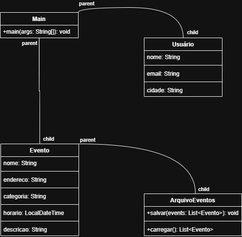

# Sistema de Eventos - Trabalho Faculdade

**Aluno:** Jonathan Tauan  
**Disciplina:** Programação Orientada a Objetos  
**Faculdade:** Anhembi Morumbi  
**IDE:** Eclipse IDE  

## 📋 Funcionalidades Implementadas ✅

- [x] Cadastro de usuário (nome, email, cidade)
- [x] Cadastro de eventos com **nome, endereço, categoria, horário e descrição**
- [x] Categorias delimitadas: Festa, Esporte, Show, Cultura
- [x] Listagem **ordenada por horário** (mais próximos primeiro)
- [x] **Confirmar participação** em qualquer evento
- [x] Visualizar eventos confirmados + **cancelar participação**
- [x] Identificar eventos **passados, atuais e futuros**
- [x] **Persistência** em arquivo `events.data` (salva/carrega)

## 🖼️ Diagrama de Classes

## 🚀 Como Executar
Abra no Eclipse
Execute classe Main.java

Cadastre seu usuário
Opção 1: Cadastre eventos
Opção 2: Liste ordenados
Opção 3: Confirme participação
Opção 8: Salve e saia

## 📁 Estrutura do Projeto
src/
└── br/com/eventos/
├── Main.java ← Ponto de entrada
├── Usuario.java ← Dados do usuário
├── Evento.java ← Eventos da cidade
└── ArquivoEventos.java ← Salva/carrega events.data

**Data:** 30/03/2026
